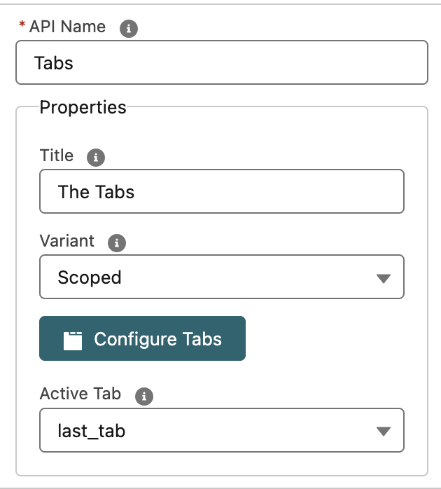
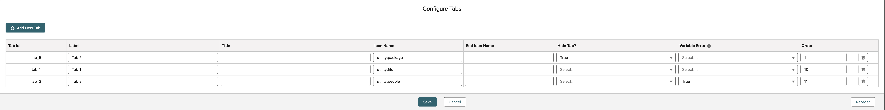

# OnDuty Flow Tabs

Lightning Web Component to use in a Flow Screen that allows to display tabs.
The component outputs the active tab so this can be used in the Component Visibility to set what to display in each tab.

## Where can I use it?

You can use this component in Flow screens.

## Properties

It has a custom editor that allows you to specify the title (tooltip) for the tabs and the variant (Standard or Scoped).

You can create the tabs with the following properties

- Label
- Title (tooltip)
- Left Icon Name (only supports utility icons) in the format utility:add e.g.
- Right Icon Name (only supports utility icons) in the format utility:add e.g.
- Variable error: a constant/variable/formula that specifies that the tab has an error, it will display an icon on the right side of the label.
- Default Active?: a radio button to specify which tab should be active by default
- Order: the Order of the tab to display in the component

## Live Demo

Live Demo on a Scratch Org: <a href="https://hosted-scratch.herokuapp.com/launch?template=https://github.com/ondutysoftwaresolutions/odFlowTabs">CLICK HERE</a>

## Installation

## Screenshots

### Configuration screens

#### Generic Properties

#### Tabs Configuration

#### Other Component Visibility

### How it looks like

#### Standard

#### Scoped

